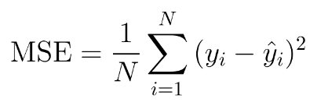
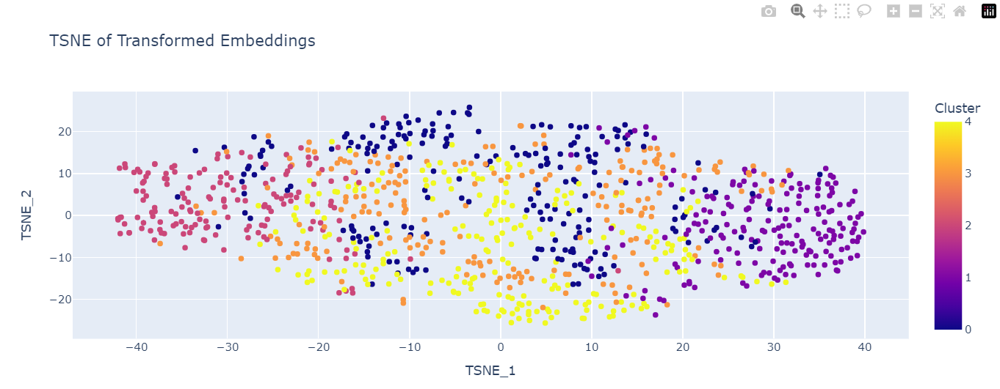

# SteamRecommendationDeepLearning

## Step 1 - Find Embeddings
### Dataset
The dataset is a collection of video games on Steam, consisting of each game's name, description and SteamID. It was taken from the GitHub Repository https://github.com/FronkonGames/Steam-Games-Scraper. I took the following pre-processing steps: removing any non-latin characters or special characters, discarding games with descriptions shorter than 50 words, and limiting descriptions to 300 words.

### Generating Embeddings

To generate my own embedding domain, I started by transforming each game description into an embedding using GloVe. In order to obtain a single vector for each description, I applied mean pooling across the GloVe embeddings of all words in the description, which was then fed to my Deep Denoising Auto Encoder, which was configured with an input dimension of 300, hidden dimension of 100, learning rate of 0.001, batch size of 64, and number of epochs of 60.

### Training Process

The loss function I used was the Mean Square Error, which measures the average squared difference between the predicted and original embeddings, encouraging the autoencoder to accurately reconstruct meaningful features of the input. Minimizing MSE helps the model capture key aspects of each game description while reducing noise, resulting in greater relevance of embeddings to the dataset.

## Step 2 - Visualize Your Embeddings

Using plotly and TSNE, I was able to create visualizations of my embeddings. I used KMeans to facilitate visualization of clusters in each projection.

The Transformed Embeddings made some clusters become denser and others become sparser. After analysing each cluster by hovering my cursor in each point in the graph, I couldn't really identify much correlation between the descrpiton of points in the same cluster. I did notice that in some cases, one cluster was full of words I didn't understand, which looked like East European languages.

## Step 3 - Test the Search System

I used cosine similarity to find game descriptions that would best match the query. I set a minimum relevance parameter of 0.8 to filter out low-relevance results.

### Test that yields 10 results
Query: "open world pirate game"

This query has varied results, possibly because of the fact that the dataset is sampled, resulting in uneven samples. Most of the time, the top results are at least open world games, with some pirate-related games in between.

### Test that yields less than 10 results
Query: "principle"

In general, queries with fewer words tend to get results with less relevance, which are not included because of the minimum relevance. This could also be a byproduct of the fact that the word principle is hardly related to games. The number of results may vary depending on the sample.

### Test that yields 10 results
Query: "not bloody"

This query, just like in my TF-IDF implementation of a search mechanism, also tends to give you results with bloody games!

